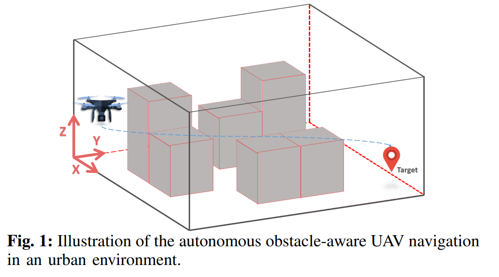
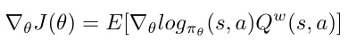
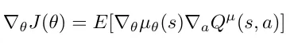
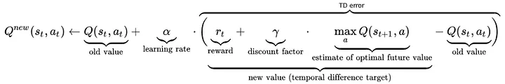
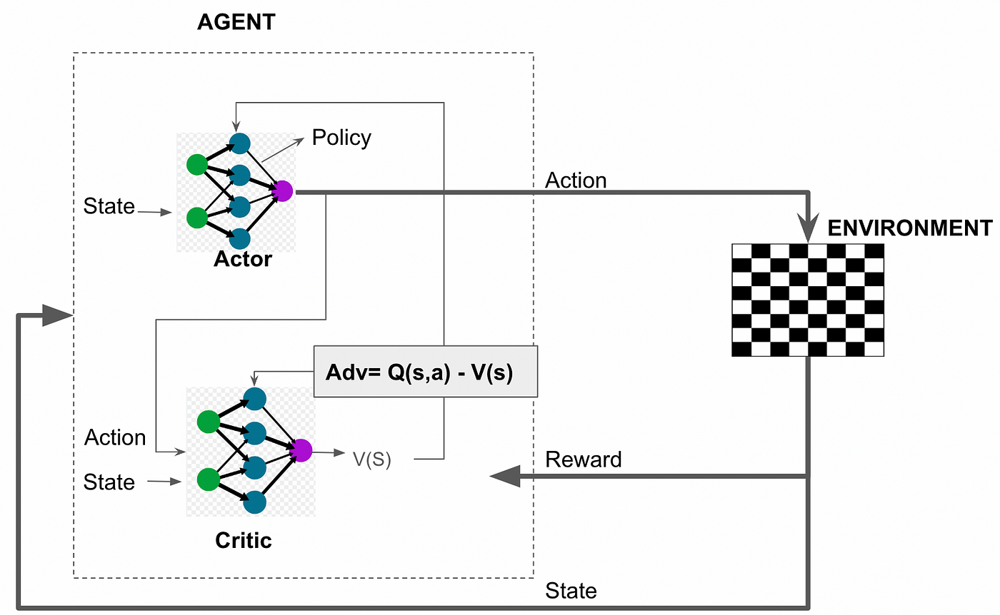
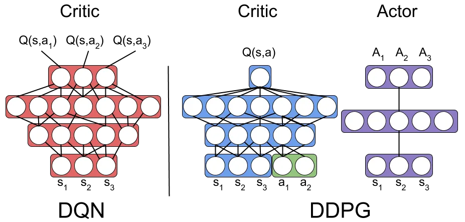

# Group_Presentation
This repo is used to do the presentation some paper shared in group meeting

## 2023-10-09
Paper: Autonomous UAV Navigation: A DDPG-based Deep Reinforcement Learning Approach

### Background & Purpose
**Background**:
1. UAV plays more and more important role in Smart City 
   1. Cargo delievery
   2. Traffic monitoring
   <!-- 3.  -->
   3. 

2. Challenges:
   1. Path finding/planning
   2. Most of the existing solutions are based on computationally **complex mixed-integer linear programming or evolutionary algorithms** that do not always achieve near-optimal solutions. 
      1. In addition, most of the existing approaches are **centralized**, which **limits the ability** of the system to **handle real-time problems** and **increases the communication overhead** between the central node and the flight units.

**Purpose**:
1.  This paper propose a framework:
    1.  Unlike existing RL-based solutions that typically operate in discretized environments, this framework aims to provide autonomous navigation for UAVs in continuous action space to reach fixed or moving targets dispersed in a 3D spatial region, taking into account the safety of the UAV.
    2.  The approach uses a **Deep Deterministic Gradient Descent (DDPG) based methodology** with the aim of allowing the UAV to determine the optimal route to accomplish its mission safely, i.e. avoiding obstacles.
    3.  In the training phase, a transfer learning approach is used to first train the UAV on how to reach its destination in an obstacle-free environment, and then the learned model is used in other environments with specific obstacle locations so that the UAV learns how to navigate to its destination avoiding obstacles.

### DDPG

Deep Deterministic Policy Gradient (DDPG), an off-policy Reinforcement Learning algorithm.

Before DDPG, we need to know some other things:
1. SPG - Stochastic Policy Gradient
2. DPG - Deterministic Policy Gradient
3. Q-learning
4. Actor-critic
5. DDPG - Deep Deterministic Policy Gradient

### SPG - Stochastic Policy Gradient

In reinforcement learning, the goal is often to find a policy $\pi_\theta(s, a)$, where $\theta$ represents parameter, that maximizes the expected return. 

#### Grad objective function of the SPG

The "grad objective function" of an algorithm is:
- the quantity that describes how the value of the objective function varies with the model parameters
- and we can update and optimize the model parameters based on this information.

#### Notations: 
- $\pi_\theta(s, a)$: This represents the **policy**, which gives the probability of taking action \( $a$ \) given state \( $s$ \).
- $Q^w(s, a)$: This is the **action-value function**, representing the **expected return** for taking action \( $a$ \) in state \( $s$ \) and then following policy \($\pi$\).
- $\nabla_\theta$: This denotes the **gradient** with respect to \( $\theta$ \).

#### Formula Explanation:
- $\nabla_\theta J(\theta)$: This is the **gradient** of the **policy's objective function** \( $J$ \) with respect to its parameters \( $\theta$ \). The goal is to optimize this objective function using gradient ascent.
- $\mathbb{E}$: This is the **expectation**, averaging over the contributions of all possible state-action pairs.
- $\nabla_\theta \log \pi_\theta(s, a)$: This is the gradient of the logarithm of the policy with respect to \( $\theta$ \). This term provides insights into how to tweak the parameter \( $\theta$ \) to **adjust the probability of taking action \( $a$ \) in state \( $s$ \).**

The essence of the formula is that we aim to:
1. increase the probability of actions that yield high returns
2.  decrease the probability of actions that lead to low returns. 

Therefore, we use the action-value function \( $Q^w(s, a)$ \) to weight the policy gradient to adjust the policy.

### DPG - Deterministic Policy Gradient

Similar to SPG, but the difference is replacing π with μ. (Deterministic policy to a policy gradient algorithm is not possible, until 2014, [see the reason here](http://proceedings.mlr.press/v32/silver14.pdf))

Unlike the SPG approach, the DPG outputs a specific action for a given state, rather than a probability distribution over actions.

#### Grad objective function of the DPG

#### Notations:
- $\mu_\theta(s)$: Represents the **deterministic policy**. For a given state \( $s$ \), it directly provides an action.
- $Q^\mu(s, a)$: This is the action-value function, representing the expected return when taking action \( $a$ \) in state \( $s$ \) and subsequently following the policy \( $\mu$ \).
- $\nabla_\theta$ and $\nabla_a$: Denote the gradients with respect to \( $\theta$ \) and action \( $a$ \), respectively.

#### Formula Explanation:
- $\nabla_\theta J(\theta)$: The gradient of the policy's objective function \( $J$ \) with respect to its parameters \( $\theta$ \). The optimization aim is to adjust this objective function via gradient ascent.
- $\mathbb{E}$: Represents the expectation, averaging over the contributions from all potential states.
- $\nabla_\theta \mu_\theta(s)$: The **gradient** of the **deterministic policy** concerning its parameters \( $\theta$ \).
- $\nabla_a Q^\mu(s, a)$: The gradient of the **action-value function** concerning action \( $a$ \). It's crucial to note that this gradient is evaluated at \( $a = \mu_\theta(s)$ \), signifying that the examination revolves around tweaking the action proposed by the policy to enhance the \( $Q$ \) value.

In a nutshell:
- **SPG seeks to optimize a probability distribution over actions**
- **DPG directly optimizes the action selection**, rendering it more efficient in certain scenarios.

### Q-learning 

Q-learning is a model-free reinforcement learning algorithm designed to estimate the** action-value function** and derive a policy that **maximizes cumulative rewards**. Here are the primary characteristics and the process of Q-learning:

1. **Action-Value Function \( $Q(s, a)$ \)**: Q-learning aims to learn a function \( $Q(s, a)$ \) that provides the expected reward for taking action \( $a$ \) in state \( $s$ \). The optimal \( $Q$ \) function, denoted as \( $Q^*(s, a)$ \), corresponds to the optimal policy.

2. **Update Rule**: At the heart of Q-learning is its update rule. As the agent interacts within the environment and observes a reward, it updates its estimate of \( $Q$ \). The update rule is given by:
\[ $Q(s, a) \leftarrow Q(s, a) + \alpha \left( r + \gamma \max_{a'} Q(s', a') - Q(s, a) \right)$ \]

Where:
   - \( $\alpha$ \) is the learning rate.
   - \( $\gamma$ \) is the discount factor, determining the value of future rewards.
   - \( $r$ \) is the reward obtained from taking action \( $a$ \) in state \( $s$ \).
   - \( $s'$ \) is the new state after taking action \( $a$ \).
   - \( $\max_{a'} Q(s', a')$ \) is the maximum Q-value for all possible actions in the new state \( $s'$ \).

Notice:
- **Model-Free**: Q-learning is model-free because it doesn't require an explicit model of the environment's transition dynamics or rewards. 
- Instead, it learns directly from interactions with the environment.

[More about Q-learning](https://medium.com/intro-to-artificial-intelligence/q-learning-a-value-based-reinforcement-learning-algorithm-272706d835cf)

### Actor-critic

Actor-Critic is an algorithmic framework in reinforcement learning that combines the strengths of policy gradient methods and value function approximation. It comprises two main components: the "Actor" and the "Critic," each with its own network structure.

Here are the main features of the Actor-Critic method:

1. **Actor**: The Actor is responsible for defining the policy. Given a state \( $s$ \), the Actor outputs an action or a distribution over actions. It aims to select actions that maximize the expected rewards.

2. **Critic**: The Critic evaluates how good or bad the action choices of the Actor are. It learns a value function, typically either an action-value function \( $Q(s, a)$ \) or a state-value function \( $V(s)$ \). The Critic then provides feedback (often in the form of TD error) to the Actor about the effectiveness of its policy.

3. **Learning Process**:
   - At each step, the agent (Actor) selects an action based on its current policy and executes it.
   - The Critic estimates the value of taking that action in that state.
   - **Using the real reward and the Critic's estimate, an "advantage" or TD error can be computed, representing the deviation of the Actor's policy from the ideal.**
   - The Actor then updates its policy using this signal (advantage or TD error).

4. **Advantages**:
   - Combines the strengths of policy search and value function approximation.
   - The Critic's estimation can reduce the variance of the policy gradient, speeding up learning.
   - **Handles continuous action spaces more stably.**

### DDPG

DDPG is a model-free off-policy actor-critic algorithm that combines:
1. Deep Q Learning(DQN)
   1. Orginal DQN works in a **discrete action space**.
2. DPG. 
   1. DPG extends it to the **continuous action space** while learning a deterministic policy.

### Simulation results

### Inspiration & Reflection

### Links
Resources & References:
1. [Paper: Autonomous UAV Navigation: A DDPG-based Deep Reinforcement Learning Approach](https://ieeexplore.ieee.org/abstract/document/9181245)
2. [Deep Deterministic Policy Gradient(DDPG) — an off-policy Reinforcement Learning algorithm](https://medium.com/intro-to-artificial-intelligence/deep-deterministic-policy-gradient-ddpg-an-off-policy-reinforcement-learning-algorithm-38ca8698131b)
3. [Paper: Deterministic Policy Gradient Algorithms](http://proceedings.mlr.press/v32/silver14.pdf)
4. [Q-learning: a value-based reinforcement learning algorithm](https://medium.com/intro-to-artificial-intelligence/q-learning-a-value-based-reinforcement-learning-algorithm-272706d835cf)
